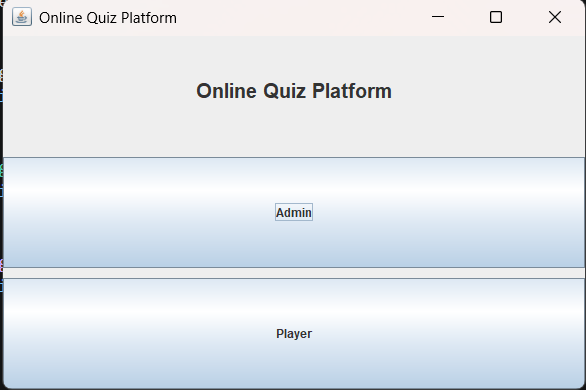
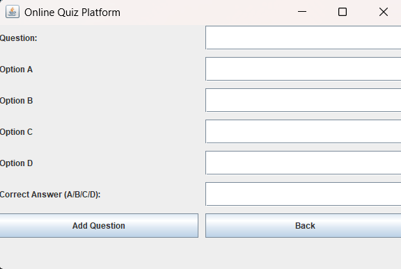
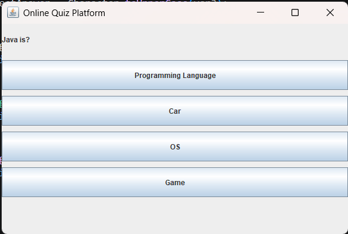

# Online Quiz Platform 📚

A Java-based interactive quiz application with a graphical user interface (GUI) built using Swing. This platform allows users to take quizzes and administrators to add new questions dynamically.

## Features ✨

- **Dual-Mode Interface**: Admin and Player modes
- **Admin Panel**: Add custom questions with multiple-choice options
- **Player Mode**: Take interactive quizzes with randomized question order
- **Score Tracking**: Automatic score calculation and persistent storage
- **GUI Interface**: User-friendly Swing-based graphical interface
- **Question Shuffling**: Questions are randomly shuffled for each quiz attempt
- **Pre-loaded Questions**: Includes 5 Object-Oriented Programming (OOPJ) questions

## Application Screenshots 📸

### Main Menu / Landing Page


*The main entry point of the application showing the Online Quiz Platform title with two options: Admin and Player modes.*

### Admin Panel - Add New Questions


*Admin interface for adding new quiz questions. Allows input of question text, four multiple-choice options (A, B, C, D), and the correct answer.*

### Player Mode - Quiz Question Display


*Example of a quiz question displayed during Player mode. Shows "Java is?" with four clickable button options: Programming Language, Car, OS, and Game.*

## Project Structure 📁

```
OOPJ Quiz/
├── Question.java       # Question model class
├── Quiz.java          # Quiz manager and score handler
├── QuizGUI.java       # Main GUI application (Entry point)
├── scores.txt         # Score storage file
└── README.md          # This file
```

## File Descriptions 📄

### `QuizGUI.java` (Entry Point)
- Main application class containing the GUI interface
- **Run this file** to start the application
- Manages the main menu, admin screen, player screen, and quiz flow
- Pre-loaded with 5 sample OOPJ questions

### `Question.java`
- Model class representing a quiz question
- Properties:
  - `questionText`: The question being asked
  - `options`: Array of 4 multiple-choice options
  - `correctAnswer`: The correct answer (A, B, C, or D)

### `Quiz.java`
- Core quiz logic and data management
- Main methods:
  - `addQuestion()`: Adds new questions to the quiz
  - `getQuestions()`: Returns all questions
  - `saveScoreToFile()`: Saves player scores to `scores.txt`

### `scores.txt`
- Stores all player scores in the format: `Name: [PlayerName] | Score: [Score]/[TotalQuestions]`
- Example:
  ```
  Name: Swapppppp | Score: 4/5
  Name: Test1 | Score: 3/5
  Name: TESTING | Score: 2/5
  ```

## How to Run 🚀

### Prerequisites
- Java Development Kit (JDK) installed (Java 8 or higher)

### Steps to Run

1. **Compile the Java files** (if not already compiled):
   ```bash
   javac Question.java
   javac Quiz.java
   javac QuizGUI.java
   ```

2. **Run the application**:
   ```bash
   java QuizGUI
   ```

3. The GUI window will open with the main menu

## How It Works 🎯

### Main Menu
When you launch the application, you'll see the main menu with two options:
- **Admin**: Add new questions to the quiz
- **Player**: Take the quiz

### Admin Mode
1. Click "Admin" from the main menu
2. Fill in the question details:
   - Enter the question text
   - Enter 4 options (A, B, C, D)
   - Specify the correct answer (A/B/C/D)
3. Click "Add Question" to add it to the quiz
4. Click "Back" to return to the main menu

### Player Mode
1. Click "Player" from the main menu
2. Enter your name
3. Click "Start Quiz"
4. Answer all 5 questions by clicking on your chosen option
5. After completing all questions, your score will be displayed
6. Your score is automatically saved to `scores.txt`

### Quiz Mechanics
- Questions are displayed one at a time
- Options are presented as clickable buttons
- Questions are shuffled in random order for each quiz attempt
- Score is calculated based on correct answers
- Final score is shown as: `Score: X/5`

## Pre-loaded Sample Questions ❓

The application comes with 5 Object-Oriented Programming Java (OOPJ) questions:

1. Java is?
   - A: Programming Language
   - B: Car
   - C: OS
   - D: Game
   - **Answer: A**

2. OOP stands for?
   - A: Object Oriented Programming
   - B: Only One Program
   - C: None
   - D: Other
   - **Answer: A**

3. Which is loop?
   - A: for
   - B: loop
   - C: repeat
   - D: iterate
   - **Answer: A**

4. JVM stands for?
   - A: Java Virtual Machine
   - B: None
   - C: Other
   - D: System
   - **Answer: A**

5. Which keyword creates object?
   - A: new
   - B: class
   - C: make
   - D: build
   - **Answer: A**

## Technical Stack 🛠️

- **Language**: Java
- **GUI Framework**: Swing (javax.swing)
- **Architecture**: Object-Oriented Design with MVC principles
- **File I/O**: Standard Java FileWriter for score persistence

## Usage Example 📝

1. Start the application
2. Choose **Admin** to add a new question about Java concepts
3. Go back to main menu and choose **Player**
4. Enter your name and start the quiz
5. Answer all questions
6. View your score and check `scores.txt` for the recorded score

## Notes 📌

- Questions are shuffled each time a player takes the quiz
- Score is calculated immediately after each answer
- All scores are appended to `scores.txt` for historical tracking
- The application uses a simple 5-question quiz structure
- Answer format is case-insensitive (A, a work the same)

## Future Enhancements 🔮

- Multiple quiz categories
- Difficulty levels
- Time-based questions
- Leaderboard display
- Question editing and deletion for admins
- Export scores to CSV

---

**Author**: OOPJ Quiz Platform  
**Version**: 1.0  
**Last Updated**: April 2026
